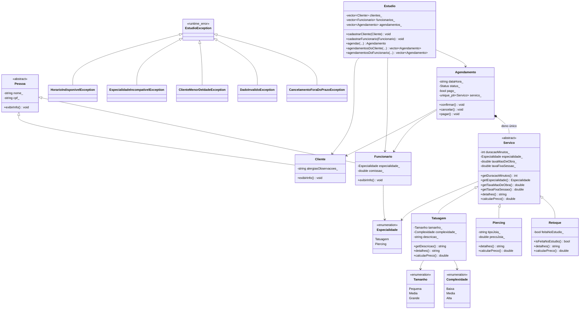

# Estúdio de Tatuagem

Sistema de gerenciamento de um estúdio de tatuagem em C++, com interface em
terminal. Projeto desenvolvido para a disciplina de Programação Orientada a
Objetos (ICMC-USP).

## Requisitos da disciplina

- **Classes**: entidades do domínio (pessoas, serviços, agendamentos, estúdio).
- **Herança**: `Cliente` e `Funcionario` herdando de `Pessoa`; `Tatuagem`,
  `Piercing` e `Retoque` herdando de `Servico`; hierarquia de exceções a
  partir de `EstudioException`.
- **Polimorfismo**: métodos virtuais puros `exibirInfo()` (em `Pessoa`) e
  `calcularPreco()` (em `Servico`), usados por meio de
  `std::unique_ptr<Servico>` no `Agendamento`, que é o único dono do
  serviço.
- **Tratamento de erros com exceções**: hierarquia própria de exceções
  derivada de `std::runtime_error`.

As classes ainda não foram implementadas — o diagrama abaixo é o ponto de
partida de design acordado pela dupla; ele pode e deve ser ajustado conforme
o código for escrito.

## Diagrama de classes



## Como compilar e rodar

Requisitos: `g++` com suporte a C++17 e `make`.

> Ainda não há código em `src/`/`include/` — o `make` só vai gerar um
> executável depois que as classes e o `main.cpp` forem escritos.

```bash
make
```

```bash
make run
```

Para limpar os artefatos de build:

```bash
make clean
```

## Estrutura de pastas

```
estudio-tatuagem/
├── include/     # Headers (.hpp) com as declarações das classes
├── src/         # Implementações (.cpp) e main.cpp
├── build/       # Artefatos de compilação (gerado pelo make, ignorado pelo git)
├── Makefile
├── .gitignore
└── README.md
```

## Fluxo de trabalho com Git

Regras da dupla:

1. A branch `main` deve **sempre compilar** (`make` sem erros).
2. Toda mudança é feita em uma branch própria, criada a partir da `main`
   atualizada, nomeada seguindo [Conventional Commits](https://www.conventionalcommits.org/):
   `<tipo>/<descricao-curta>`, por exemplo `feat/cadastro-cliente`,
   `fix/calculo-preco-tatuagem`, `docs/atualizar-readme`.
   Tipos mais usados:
   - `feat/` — nova funcionalidade
   - `fix/` — correção de bug
   - `refactor/` — refatoração sem mudança de comportamento
   - `docs/` — documentação
   - `test/` — testes
   - `chore/` — tarefas de manutenção (build, configs, etc.)
3. As mensagens de commit também devem seguir Conventional Commits:
   `<tipo>: <descrição>` (ex.: `feat: adiciona cadastro de cliente`).
4. Ao terminar, abra um Pull Request para a `main`. **O outro integrante deve
   revisar antes do merge.**
5. Antes de começar algo novo, sempre atualize sua `main` local com
   `git pull`.

### Comandos básicos (para quem tem pouca experiência com git)

Atualizar a `main` local antes de começar algo novo:

```bash
git checkout main
git pull
```

Criar uma branch a partir da main atualizada, usando o padrão
`<tipo>/<descricao-curta>`:

```bash
git checkout -b feat/nome-da-feature
```

Ver o que foi alterado:

```bash
git status
git diff
```

Adicionar e commitar as mudanças:

```bash
git add .
git commit -m "feat: descrição clara da mudança"
```

Enviar a branch para o GitHub:

```bash
git push -u origin feat/nome-da-feature
```

Depois disso, abra o Pull Request na interface do GitHub (ou com
`gh pr create`), peça revisão do colega e só então faça o merge para a
`main`.

Após o merge, volte para a main e atualize antes de começar a próxima tarefa:

```bash
git checkout main
git pull
```

## Divisão de tarefas

| Tarefa | Responsável |
|--------|-------------|
| `Servico` → `Tatuagem`, `Piercing`, `Retoque` | Luís |
| `Pessoa` → `Cliente`, `Funcionario` | Miguel |
| `Agendamento` | a definir |
| Exceções (`EstudioException` e derivadas) | a definir |
| `Estudio` e menu | a definir (em dupla) |

## Autores

- Luís Filipe Vasconcelos Peres
- Miguel Lima
