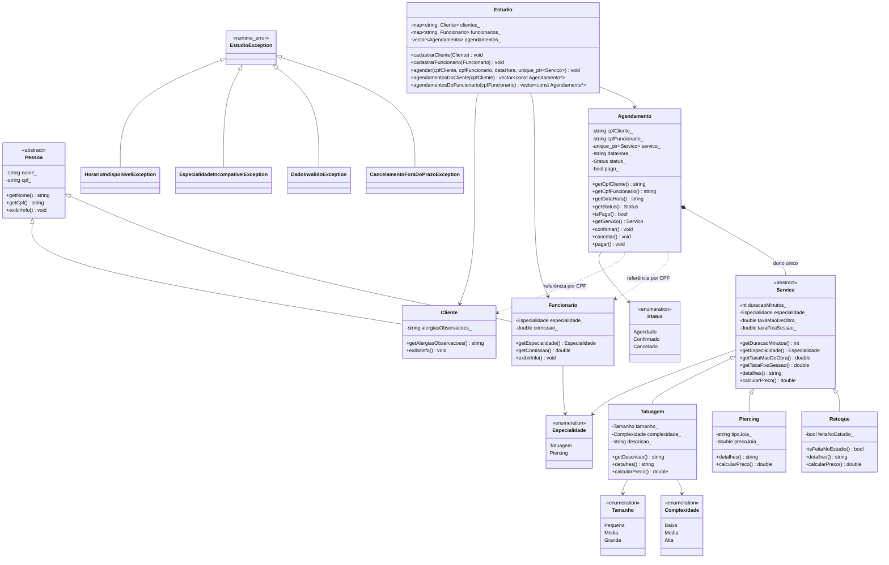

# Estúdio de Tatuagem

Sistema de gerenciamento de um estúdio de tatuagem em C++, com interface em
terminal. Projeto desenvolvido para a disciplina de Programação Orientada a
Objetos (ICMC-USP).

## Uso de IA

Este projeto usa o Claude Code (Anthropic) como ferramenta de apoio. A
implementação do código (classes, lógica e `main`) é feita manualmente pela
dupla; o objetivo da disciplina é aprender, e por isso a IA não escreve o
código-fonte do projeto.

A IA é usada para:

- **Documentação:** edição do README, do diagrama de classes e do registro
  de decisões (`docs/decisoes.md`). Os commits desse tipo trazem a linha
  `Co-Authored-By` no histórico do git.
- **Apoio ao aprendizado:** funciona como tutor, explicando conceitos,
  propondo perguntas e experimentos e discutindo alternativas de design. As
  decisões são tomadas pela dupla.
- **Revisão de código:** apontar problemas e sugerir melhorias no código já
  escrito, que a dupla avalia e aplica por conta própria.

## Requisitos da disciplina

- **Classes**: entidades do domínio (pessoas, serviços, agendamentos, estúdio).
- **Herança**: `Cliente` e `Funcionario` herdando de `Pessoa`; `Tatuagem`,
  `Piercing` e `Retoque` herdando de `Servico`; hierarquia de exceções a
  partir de `EstudioException`.
- **Polimorfismo**: métodos virtuais puros `exibirInfo()` (em `Pessoa`) e
  `calcularPreco()` (em `Servico`), usados por meio de
  `std::unique_ptr<Servico>` no `Agendamento`, que é o único dono do
  serviço.
- **Tratamento de erros com exceções**: hierarquia própria de exceções
  derivada de `std::runtime_error`.

Todas as classes do diagrama estão implementadas: as hierarquias de
`Servico`, `Pessoa` e de exceções, o `Agendamento`, o `Estudio` e o menu
interativo em `src/main.cpp`. O menu permite cadastrar clientes e
funcionários, agendar serviços e listar os agendamentos de um cliente ou de
um funcionário. Mudar o estado de um agendamento (confirmar, cancelar,
pagar) pelo menu está fora do escopo da entrega atual (ver entrada 17 de
[`docs/decisoes.md`](docs/decisoes.md)). O diagrama abaixo reflete o código
atual, e as justificativas de design estão no registro de decisões.

## Diagrama de classes


```mermaid
classDiagram
    class Pessoa {
        <<abstract>>
        -string nome_
        -string cpf_
        +getNome() string
        +getCpf() string
        +exibirInfo() void
    }

    class Cliente {
        -string alergiasObservacoes_
        +getAlergiasObservacoes() string
        +exibirInfo() void
    }

    class Funcionario {
        -Especialidade especialidade_
        -double comissao_
        +getEspecialidade() Especialidade
        +getComissao() double
        +exibirInfo() void
    }

    class Especialidade {
        <<enumeration>>
        Tatuagem
        Piercing
    }

    Pessoa <|-- Cliente
    Pessoa <|-- Funcionario
    Funcionario --> Especialidade
    Servico --> Especialidade

    class Servico {
        <<abstract>>
        -int duracaoMinutos_
        -Especialidade especialidade_
        -double taxaMaoDeObra_
        -double taxaFixaSessao_
        +getDuracaoMinutos() int
        +getEspecialidade() Especialidade
        +getTaxaMaoDeObra() double
        +getTaxaFixaSessao() double
        +detalhes() string
        +calcularPreco() double
    }

    class Tatuagem {
        -Tamanho tamanho_
        -Complexidade complexidade_
        -string descricao_
        +getDescricao() string
        +detalhes() string
        +calcularPreco() double
    }

    class Tamanho {
        <<enumeration>>
        Pequena
        Media
        Grande
    }

    class Complexidade {
        <<enumeration>>
        Baixa
        Media
        Alta
    }

    Tatuagem --> Tamanho
    Tatuagem --> Complexidade

    class Piercing {
        -string tipoJoia_
        -double precoJoia_
        +detalhes() string
        +calcularPreco() double
    }

    class Retoque {
        -bool feitaNoEstudio_
        +isFeitaNoEstudio() bool
        +detalhes() string
        +calcularPreco() double
    }

    Servico <|-- Tatuagem
    Servico <|-- Piercing
    Servico <|-- Retoque

    class Agendamento {
        -string cpfCliente_
        -string cpfFuncionario_
        -unique_ptr~Servico~ servico_
        -string dataHora_
        -Status status_
        -bool pago_
        +getCpfCliente() string
        +getCpfFuncionario() string
        +getDataHora() string
        +getStatus() Status
        +isPago() bool
        +getServico() Servico
        +confirmar() void
        +cancelar() void
        +pagar() void
    }

    class Status {
        <<enumeration>>
        Agendado
        Confirmado
        Cancelado
    }

    Agendamento --> Status

    class Estudio {
        -map~string, Cliente~ clientes_
        -map~string, Funcionario~ funcionarios_
        -vector~Agendamento~ agendamentos_
        +cadastrarCliente(Cliente) void
        +cadastrarFuncionario(Funcionario) void
        +agendar(cpfCliente, cpfFuncionario, dataHora, unique_ptr~Servico~) void
        +agendamentosDoCliente(cpfCliente) vector~const Agendamento*~
        +agendamentosDoFuncionario(cpfFuncionario) vector~const Agendamento*~
    }

    Agendamento ..> Cliente : referência por CPF
    Agendamento ..> Funcionario : referência por CPF
    Agendamento *-- Servico : dono único
    Estudio --> Cliente
    Estudio --> Funcionario
    Estudio --> Agendamento

    class EstudioException {
        <<runtime_error>>
    }

    class HorarioIndisponivelException
    class EspecialidadeIncompativelException
    class DadoInvalidoException
    class CancelamentoForaDoPrazoException

    EstudioException <|-- HorarioIndisponivelException
    EstudioException <|-- EspecialidadeIncompativelException
    EstudioException <|-- DadoInvalidoException
    EstudioException <|-- CancelamentoForaDoPrazoException
```

## Como compilar e rodar

Requisitos: `g++` com suporte a C++17 e `make`.

O `make` gera o executável em `build/estudio-tatuagem`, e o `make run`
compila e abre o menu interativo no terminal.

```bash
make
```

```bash
make run
```

Para limpar os artefatos de build:

```bash
make clean
```

## Estrutura de pastas

```
estudio-tatuagem/
├── include/     # Headers (.hpp) com as declarações das classes
├── src/         # Implementações (.cpp) e main.cpp
├── docs/        # Registro de decisões de design (decisoes.md)
├── build/       # Artefatos de compilação (gerado pelo make, ignorado pelo git)
├── Makefile
├── .gitignore
└── README.md
```

## Fluxo de trabalho com Git

Regras da dupla:

1. A branch `main` deve **sempre compilar** (`make` sem erros).
2. Toda mudança é feita em uma branch própria, criada a partir da `main`
   atualizada, nomeada seguindo [Conventional Commits](https://www.conventionalcommits.org/):
   `<tipo>/<descricao-curta>`, por exemplo `feat/cadastro-cliente`,
   `fix/calculo-preco-tatuagem`, `docs/atualizar-readme`.
   Tipos mais usados:
   - `feat/` — nova funcionalidade
   - `fix/` — correção de bug
   - `refactor/` — refatoração sem mudança de comportamento
   - `docs/` — documentação
   - `test/` — testes
   - `chore/` — tarefas de manutenção (build, configs, etc.)
3. As mensagens de commit também devem seguir Conventional Commits:
   `<tipo>: <descrição>` (ex.: `feat: adiciona cadastro de cliente`).
4. Ao terminar, abra um Pull Request para a `main`. **O outro integrante deve
   revisar antes do merge.**
5. Antes de começar algo novo, sempre atualize sua `main` local com
   `git pull`.

### Comandos básicos (para quem tem pouca experiência com git)

Atualizar a `main` local antes de começar algo novo:

```bash
git checkout main
git pull
```

Criar uma branch a partir da main atualizada, usando o padrão
`<tipo>/<descricao-curta>`:

```bash
git checkout -b feat/nome-da-feature
```

Ver o que foi alterado:

```bash
git status
git diff
```

Adicionar e commitar as mudanças:

```bash
git add .
git commit -m "feat: descrição clara da mudança"
```

Enviar a branch para o GitHub:

```bash
git push -u origin feat/nome-da-feature
```

Depois disso, abra o Pull Request na interface do GitHub (ou com
`gh pr create`), peça revisão do colega e só então faça o merge para a
`main`.

Após o merge, volte para a main e atualize antes de começar a próxima tarefa:

```bash
git checkout main
git pull
```

## Divisão de tarefas

| Tarefa | Responsável |
|--------|-------------|
| `Servico` → `Tatuagem`, `Piercing`, `Retoque` | Luís |
| `Pessoa` → `Cliente`, `Funcionario` | Miguel |
| `Agendamento` | Luís |
| Exceções (`EstudioException` e derivadas) | Luís |
| `Estudio` e menu | Miguel |

## Autores

- Luís Filipe Vasconcelos Peres
- Miguel Lima
